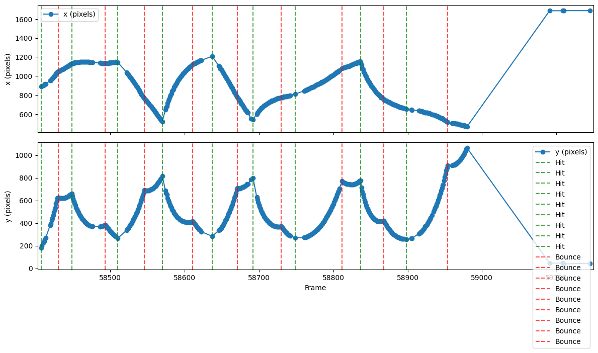
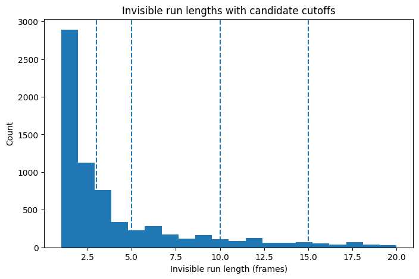
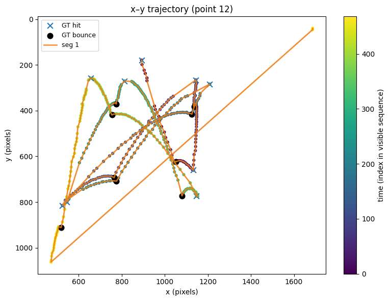
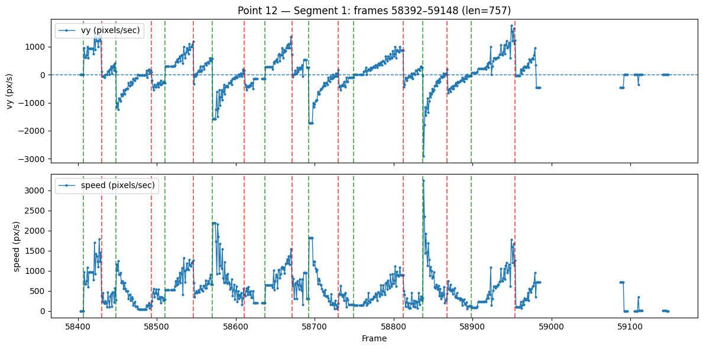

# 🎾 Tennis Ball Hit & Bounce Detection from Video Trajectories

## Overview

This project focuses on **detecting tennis ball hits and bounces** during a rally using only **ball trajectory data** extracted from broadcast video.

Given:
- the full video of a professional tennis match (Roland-Garros 2025 final)
- per-point ball tracking data `(x, y, visible)` at **50 FPS**

the goal is to infer **when the ball is hit by a player** and **when it bounces on the court**, using:
- physics-based reasoning
- time-series analysis
- unsupervised methods
- supervised deep learning (LSTM)

The final output is an enriched JSON file where each frame is labeled as:

```json
"pred_action": "air" | "hit" | "bounce"
```

## Dataset Description
### Ball Tracking Data

Each tennis point is stored as a JSON file:
```text
per_point_v2/
 ├── ball_data_0.json
 ├── ball_data_1.json
 ├── ...
 └── ball_data_328.json
```

Each JSON maps video frame numbers to ball information:

```json
{
  "56100": {
    "x": 894,
    "y": 395,
    "visible": true,
    "action": "air"
  }
}
```

## Fields

- **`frame`** — Absolute frame index in the full video  
- **`x`** — Horizontal pixel position *(1920 px wide)*  
- **`y`** — Vertical pixel position *(1080 px high, origin at top-left)*  
- **`visible`** — Whether the ball was detected in this frame  
- **`action`** — Ground-truth label: `air`, `hit`, `bounce`

> **Note:** When `visible = false`, the coordinates may be missing or unreliable.

---

## Coordinate System & Physical Intuition

### Coordinate System
- Origin is at the **top-left corner**
- The **x-axis** increases to the right
- The **y-axis** increases **downward**

### Physical Behavior

**Gravity**
- Causes the ball to **accelerate downward** during flight  
- Produces an **abrupt reversal of vertical velocity** at a bounce  

**Hits**
- Create **sudden changes in velocity and acceleration**
- Often induce **strong direction changes**


### Example : Ball trajectory in one point



### Step 1 — Segmentation by Visibility

Raw ball tracking contains long invisible periods:

- between points

- during serve preparation

- when the ball goes out

### Strategy

- Split each point into segments of continuous play

- Break segments when the number of consecutive invisible frames exceeds a threshold

```text
max_invisible_run = 137   (~2.7 seconds at 50 FPS)
```

This ensures:

- interpolation is applied only to short gaps

- long dead periods are removed



### Step 2 — Feature Engineering (Physics-Based)

For each segment, the following features are computed per frame.

### Position & Motion

- **`x`**, **`y`** (interpolated)

- **`vx**`, `**vy**` — velocities

- `**ax**`, `**ay**` — accelerations

- `**speed = sqrt(vx² + vy²)**`

- `**dv = |Δvy|**`

### Direction Changes

- `**dir_x**` — horizontal direction flip

- `**dir_y**` — vertical direction flip

### Geometry & Context

- **`y_norm`** — normalized height within the segment

- **`visible`** flag





These features encode:

- gravity

- impacts

- ground contact

- racket contact

### Step 3 — Unsupervised Baseline (Physics + Rules)

Before supervised learning, an unsupervised baseline was implemented using:

- velocity and acceleration peaks

- vertical direction changes

- bounce detection via local maxima of **`y`**

- tennis structure constraints:

   - at most one hit between two bounces

This baseline achieved reasonable recall but suffered from limited precision, motivating a supervised approach.

### Step 4 — Supervised Learning with LSTM
###Problem Formulation

The task is modeled as a time-series classification problem.

###Past → Next prediction

- Input: a sliding window of W frames

- Output: the label of the next frame

```text
Frames: [t-W+1 ... t]  →  predict label at t+1
``` 
This formulation:

- is causal

- leverages temporal context

- allows dense supervision

###Sliding Window Dataset

- Windows are extracted within segments

- Windows never cross segment or point boundaries

- Each window produces one training sample

###Model Architecture

- Bidirectional LSTM

- Input shape: [batch, time, features]

- Output: class logits (air, hit, bounce)

```text
Input → BiLSTM → Fully Connected → Softmax
``` 
### Train / Test Split (Critical)

⚠️ The split is performed at the POINT level, not frame or window level.

- Each JSON file (one tennis point) is assigned entirely to:

  - Training set (~80%)

  - Validation/Test set (~20%)

This prevents:

- temporal leakage

- trajectory memorization

- inflated evaluation metrics

### Step 5 — Dense Predictions → Event Consolidation

The LSTM produces dense frame-level predictions, for example:

```text
hit hit hit hit hit
```
But the objective is to detect single events.

### Consolidation Rules

1. Group consecutive predictions into runs

2. Select one representative frame:

  - hits → max impulse (|Δv|)

  - bounces → max vertical position (y)

3. Remove hits too close to bounces

4. Enforce tennis structure:

  - ≤ 1 hit between two bounces

### Step 6 — Event-Level Evaluation

Frame-level metrics are misleading due to:

- extreme class imbalance

- temporal uncertainty around impacts

Instead, evaluation is performed at the event level, using a tolerance window:

```text
Prediction is correct if |pred_frame - gt_frame| ≤ tolerance
```
### Example Results 

**Epoch:** 10 / 10  
**Final Loss:** `0.0165`

---

## Confusion Matrix
[[16390  4530  7041]

[    7   305     2]

[   18    11   312]]

Rows correspond to **ground truth**, columns to **predictions**  
Class order: `air`, `bounce`, `hit`

---

## Classification Report

| Class   | Precision | Recall | F1-score | Support |
|--------:|----------:|-------:|---------:|--------:|
| air     | 0.998     | 0.586  | 0.739    | 27,961  |
| bounce  | 0.063     | 0.971  | 0.118    | 314     |
| hit     | 0.042     | 0.915  | 0.081    | 341     |
| **Accuracy** |          |        | **0.594** | 28,616 |
| **Macro Avg** | 0.368 | 0.824 | 0.313 | 28,616 |
| **Weighted Avg** | 0.977 | 0.594 | 0.724 | 28,616 |

---

## Per-Point Evaluation

**Evaluating file:** `ball_data_115.json`

### Predicted Events

- **Predicted hits:**  
[324606, 324639, 324722, 324770, 324877, 324935, 325050, 325199]


- **Predicted bounces:**  


[324626, 324694, 324754, 324852, 324913, 324973, 325008, 325031, 325160]


---

## Temporal Tolerance Evaluation

### Hit Detection

| Tolerance (±frames) | TP | FP | FN |
|--------------------:|---:|---:|---:|
| 3   | 6 | 2 | 3 |
| 5   | 7 | 1 | 2 |
| 10  | 7 | 1 | 2 |
| 25  | 7 | 1 | 2 |
| 50  | 7 | 1 | 2 |

### Bounce Detection

| Tolerance (±frames) | TP | FP | FN |
|--------------------:|---:|---:|---:|
| 3   | 8 | 1 | 0 |
| 5   | 8 | 1 | 0 |
| 10  | 8 | 1 | 0 |
| 50  | 8 | 1 | 0 |


- Perfect recall for bounce

- Moderate over-detection, handled via consolidation

### Final Output Format

Each frame in the JSON file is enriched with a predicted action:

```json
{
  "56100": {
    "x": 894,
    "y": 395,
    "visible": true,
    "action": "air",
    "pred_action": "bounce"
  }
}
```
This output can be:

- visualized with trajectory overlays

- aligned with video clips

- used for match statistics

---

To load the model : 

Use the `load_lstm_model()` function

---

### Key Takeaways

- Physics-based features are highly informative

- Temporal modeling is essential for sports analytics

- Frame-level accuracy is misleading for event detection

- Event-level evaluation reflects real performance

- Combining ML with domain rules yields robust results

---

### Possible Extensions

- Confidence-based event filtering

- Transformer-based temporal models

- Player-specific hit classification

- Serve detection

- Rally segmentation

---

### Author
```text
Developed by [BOUTZIL Jad]
Machine Learning / Computer Vision Project
Roland-Garros 2025 — Ball Tracking Analysis


